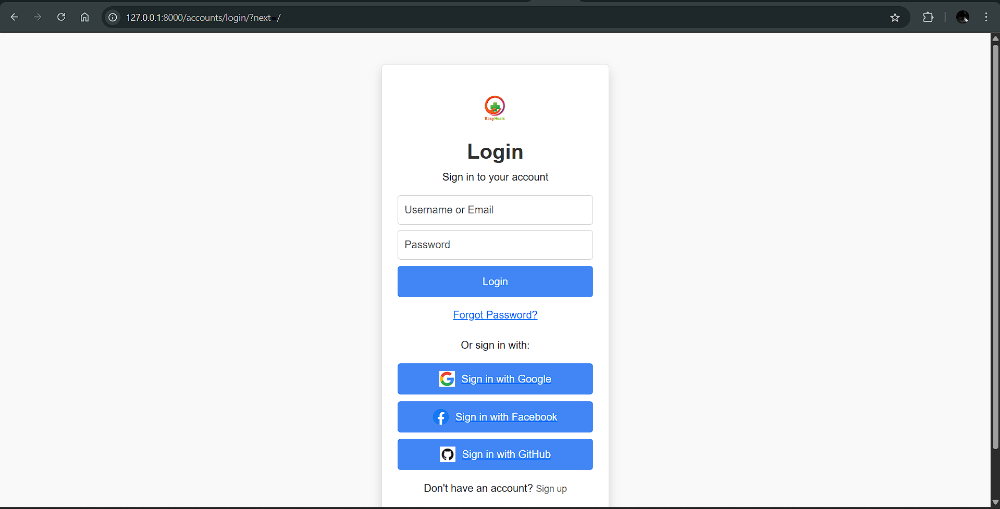
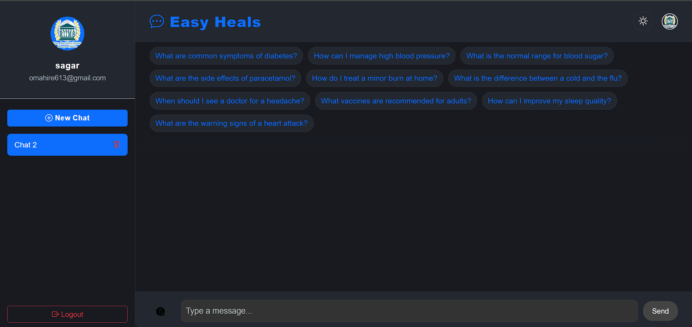
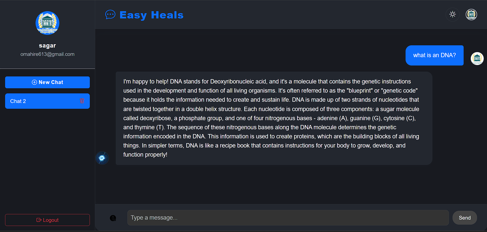
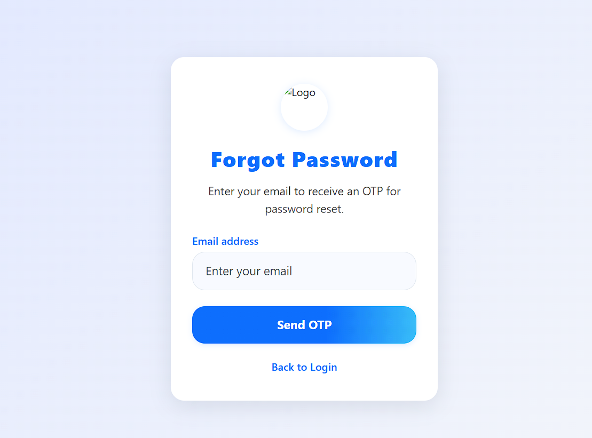
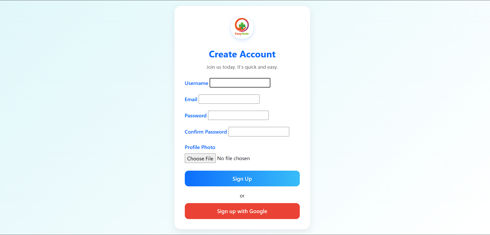

# 🩺 Easy Heals Chatbot

Welcome to **Easy Heals Chatbot** – an AI-powered medical chat assistant built with Django, LangChain, Ollama, and modern web technologies.

---

## 📸 Screenshots

| Login Page | Chat UI | Forgot Password | Signup |
|:----------:|:-------:|:---------------:|:------:|
|  |   |  |  |

---

## 🗂️ Project Directory Structure

```plaintext
core/Webapp/
│
├── core/
│   ├── migrations/
│   ├── static/
│   │   ├── css/
│   │   └── js/
│   ├── templates/
│   │   ├── admin_view/
│   │   │   └── index.html
│   │   └── account/
│   │       ├── login.html
│   │       ├── signup.html
│   │       ├── forgot_password.html
│   │       └── verify_otp.html
│   ├── models.py
│   ├── views.py
│   ├── urls.py
│   └── ...
├── media/
│   └── profile_photos/
├── static/
├── screenshots/
│   ├── login.png
│   ├── chats1.png
│   ├── chats2.png
│   ├── forgotpassword.png
│   └── signup.png
├── Webapp/
│   ├── settings.py
│   └── ...
├── .env
├── requirements.txt
└── README.md
```

---

## 🚀 Setup Instructions

**Follow these steps to set up and run the project:**

1. **Clone the Repository**
    ```bash
    git clone https://github.com/aalexander47/EasyHeals.git
    cd EasyHeals/Webapp
    ```

2. **Create & Activate a Virtual Environment**
    ```bash
    python -m venv venv
    # Windows:
    venv\Scripts\activate
    # Linux/Mac:
    source venv/bin/activate
    ```

3. **Install Dependencies**
    ```bash
    pip install -r requirements.txt
    ```

4. **Configure Environment Variables**
    - Copy `.env.example` to `.env` and fill in your secrets:
      - Django secret key
      - PostgreSQL credentials
      - Email SMTP credentials (for password reset)
      - Social login keys (Google, Facebook, GitHub)

5. **Set Up PostgreSQL Database**
    - Ensure PostgreSQL is running.
    - Create a database and user matching your `.env` settings.

6. **Apply Migrations**
    ```bash
    python manage.py makemigrations
    python manage.py migrate
    ```

7. **Create a Superuser (Optional)**
    ```bash
    python manage.py createsuperuser
    ```

8. **Run the Development Server**
    ```bash
    python manage.py runserver
    ```

9. **Access the Application**
    - Open [http://127.0.0.1:8000/](http://127.0.0.1:8000/) in your browser.

---

**Enjoy using Easy Heals Chatbot!**

